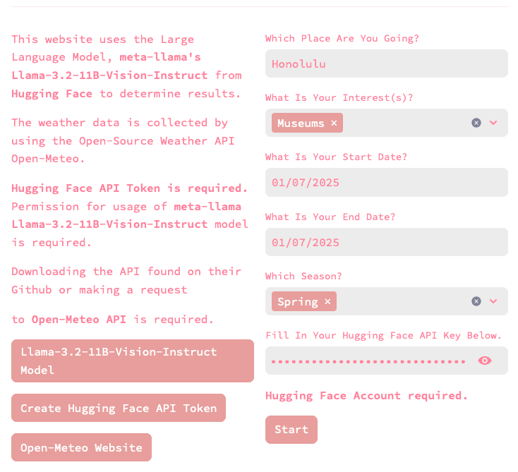
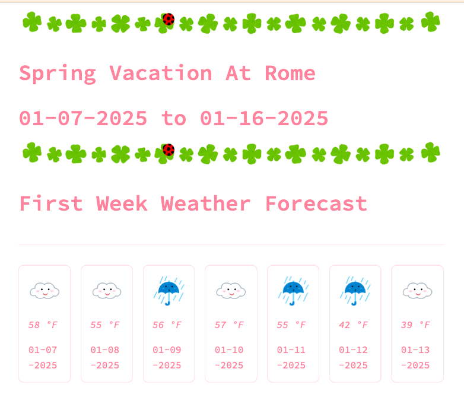
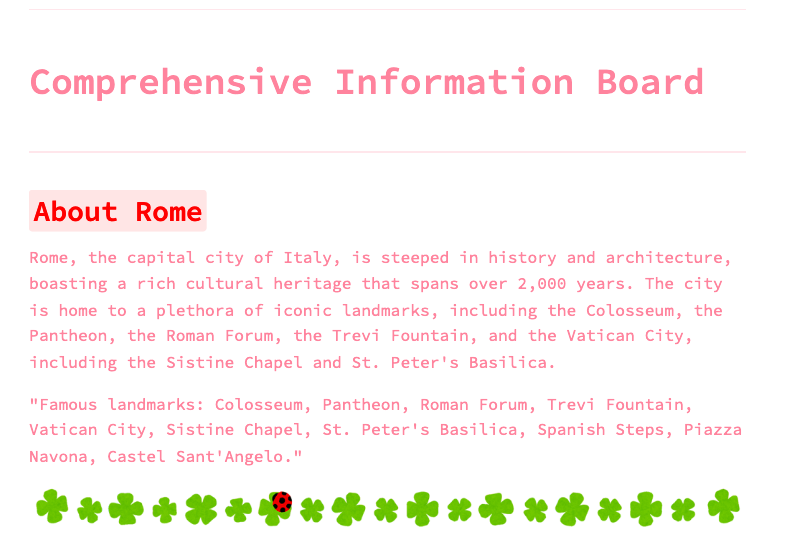
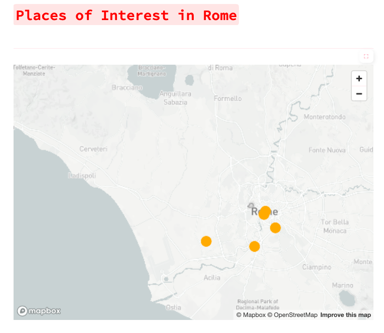
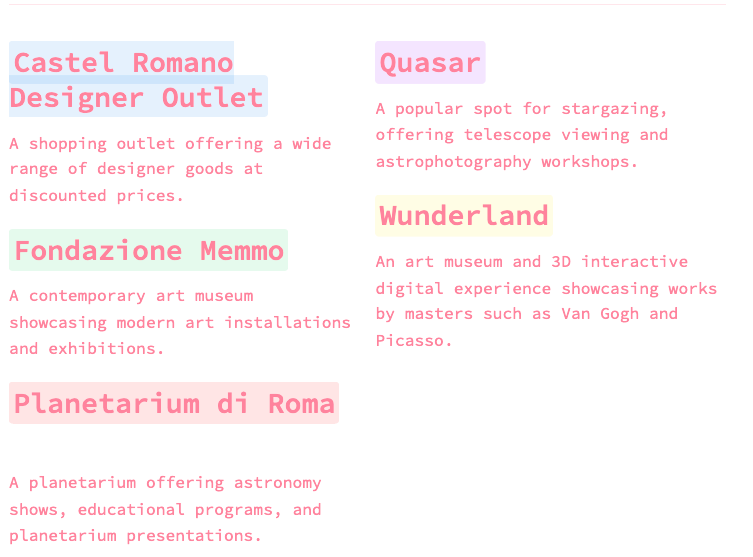
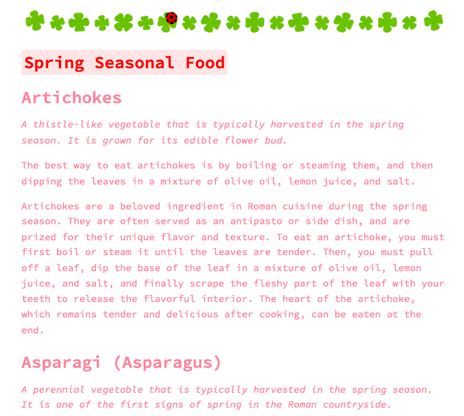
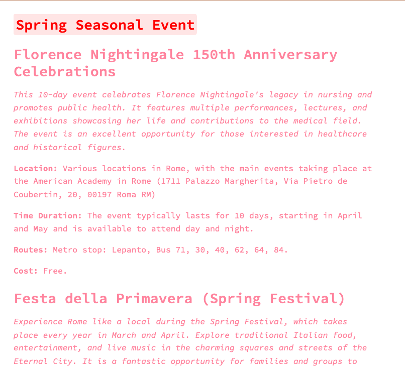

# LlamaVacationPlanner

## Overview

A Vacation Planning Platform. By inputting the following:
1) Your destination's name
2) The date of arrival and departure 
3) The interests you may have 
4) The Season of Arrival

It will give the following:
1) An **Introduction** to the location
2) **Weather Data** of the first week 
   - (Limited to coordinates where the latitude and longitude are less than 90 and doesn't exceed -90)
3) **Recommended interest-related places** near and in your destination
4) **Map** data of nearby places near your destination for visualization
5) **Seasonal Events and Food** according to the season and destination



## Table of Content
- [Getting Started](#getting-started)
- [Prerequisites](#prerequisites)
    - [Installing](#installing)
- [Usage Of Platform](#usage-of-platform)
- [Resources](#resources)

## Getting Started

## Prerequisites
This program uses:
- Python 3.13.1.


1. Create a Free API Key at [Hugging Face](https://huggingface.co/)
2. Ask permission for usage of model [Llama-3.2-11B-Vision-Instruct](https://huggingface.co/meta-llama/Llama-3.2-11B-Vision-Instruct) on Hugging Face in order to use this Streamlit application.

### Installing
1) Clone the repository.
```sh
$ git clone git@github.com:nerutoki/LlamaVacationPlanner.git
$ cd LlamaVacationPlanner
```

2) Create a virtual environment.

```sh
$ python3 -m venv env
$ source env/bin/activate
```

3) Install the required packages.

```sh
pip install uv
uv pip install -r requirements.txt
```

## Run
Run the code below in your terminal. A website page should appear shortly in your browser after executing the code.

```sh
$ streamlit run frontend.py
```

## Usage of Platform
1) Fill in the fields below. 


3) Click "Start".If the fields are not filled in properly, it will not proceed. If an unvalid Hugging Face API is given, there will be errors. The result is as shown below.








## Resources
- The Large Language Model, Meta Llama-3.2-11B-Vision-Instruct, https://huggingface.co/meta-llama/Llama-3.2-11B-Vision-Instruct is used.
- Create Free Hugging Face Token at https://huggingface.co/
- The Weather API, Open-Meteo is used. https://open-meteo.com/
- Images used in the platform are owned by Irasutoya. As required, 21 or less images were used and not modified. This is not used for commercial purposes. Rules on the usage of their images can be found on their official website. https://www.irasutoya.com/
